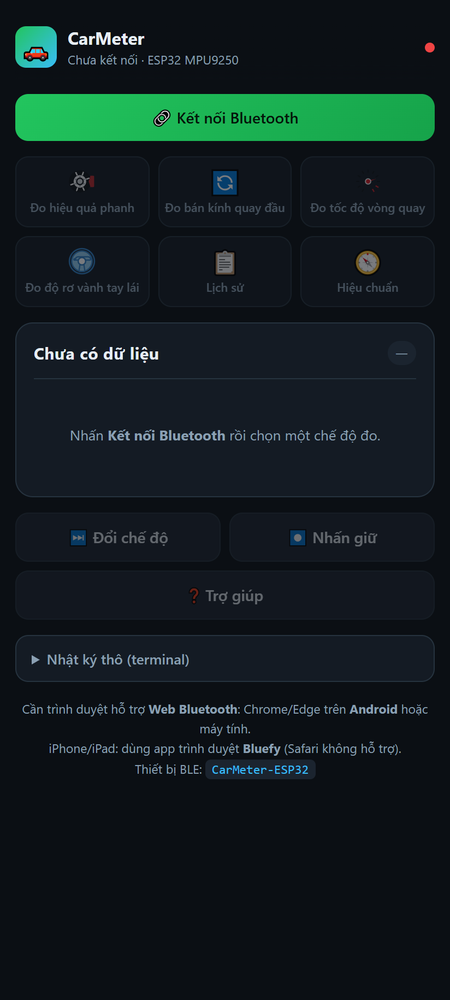
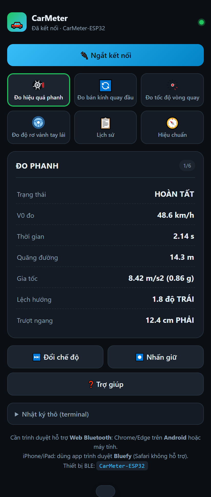
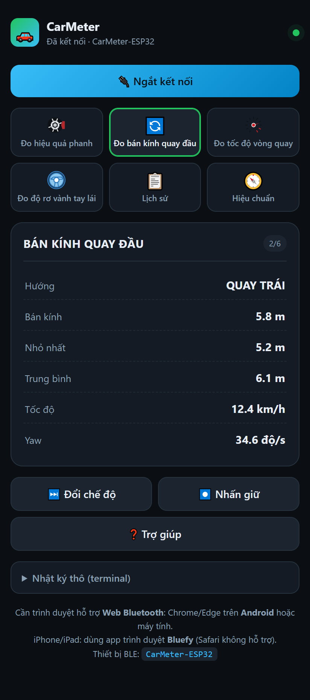
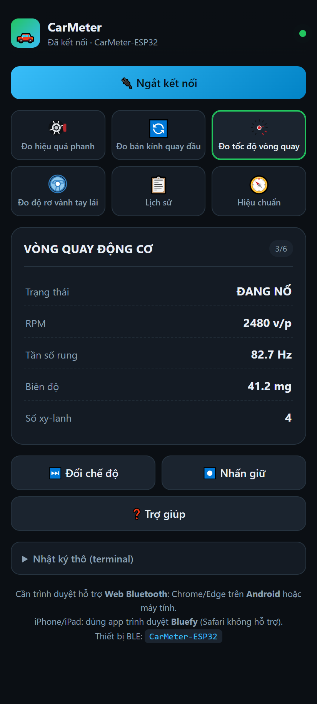
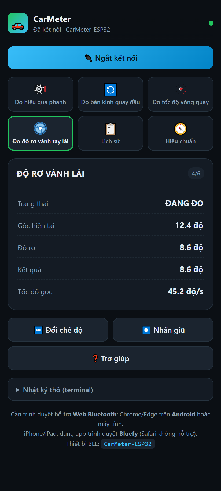
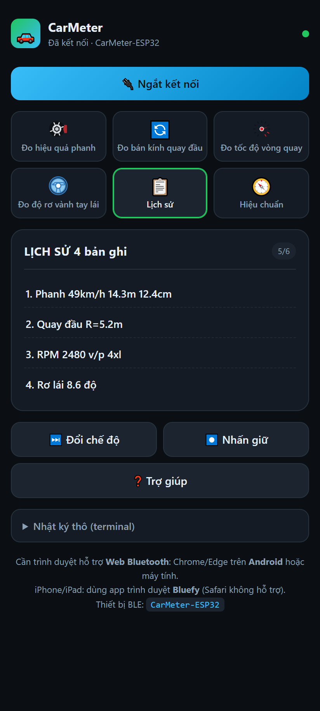
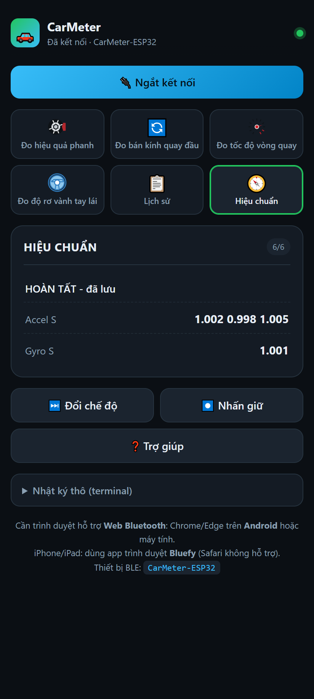

# CarMeter Web App — Hướng dẫn chi tiết

Giao diện web hiển thị số liệu đo từ ESP32 (`CarMeter-ESP32`) qua Bluetooth (BLE),
thay cho nRF Connect. Kết nối trực tiếp tới Nordic UART Service, hiển thị dạng thẻ
đẹp và có nút bấm điều khiển 6 chế độ đo. Toàn bộ nằm trong **1 file** `index.html`
(không cần cài đặt, không phụ thuộc mạng).

## Ảnh màn hình

| Chưa kết nối | Đo phanh | Bán kính quay đầu |
|:---:|:---:|:---:|
|  |  |  |

| Tốc độ vòng quay | Độ rơ vành lái | Lịch sử | Hiệu chuẩn |
|:---:|:---:|:---:|:---:|
|  |  |  |  |

> Ảnh chụp ở kích thước điện thoại (412px, Retina 2×) với dữ liệu mẫu.

---

## 1. Yêu cầu trình duyệt

Web Bluetooth chỉ chạy trên **Chrome / Edge** và **trong ngữ cảnh bảo mật**
(HTTPS, hoặc `localhost`, hoặc mở file `file://` trên máy tính):

| Thiết bị | Cách chạy |
|---|---|
| **Máy tính (Win/Mac/Linux)** | Chrome/Edge — mở thẳng `index.html` (`file://`). Máy phải có Bluetooth. |
| **Android** | Chrome — phải mở qua link **HTTPS** (xem mục 5). |
| **iPhone / iPad** | Safari **KHÔNG** hỗ trợ → cài app trình duyệt **Bluefy**, mở link HTTPS trong đó. |

> ⚠️ Mở web qua địa chỉ IP LAN kiểu `http://192.168.x.x` **sẽ bị chặn** (không phải
> ngữ cảnh bảo mật). Điện thoại cần một link bắt đầu bằng **https://**.

---

## 2. Chuẩn bị ESP32

1. Nạp firmware, cấp nguồn ESP32.
2. **Để xe/cảm biến đứng yên ~3 giây** lúc khởi động (firmware đang hiệu chuẩn bias
   gyro). Nếu không thấy MPU9250, firmware dừng và **không stream số liệu**.
3. ESP32 phát quảng bá BLE tên **`CarMeter-ESP32`**.

---

## 3. Kết nối

1. Mở web app trên trình duyệt hợp lệ (mục 1).
2. Bấm nút xanh lá **🔗 Kết nối Bluetooth**.
3. Cửa sổ chọn thiết bị của trình duyệt hiện ra → chọn **`CarMeter-ESP32`** → **Pair/Ghép nối**.
4. Kết nối xong:
   - Chấm tròn góc phải chuyển **xanh lá**, dòng chữ đổi thành *"Đã kết nối · CarMeter-ESP32"*.
   - Nút đổi thành **🔌 Ngắt kết nối** (màu xanh dương).
   - **6 ô chế độ và các nút hết mờ** (bấm được).
   - Web **tự gửi lệnh `d`** → ESP32 chuyển sang **gói dữ liệu gọn** (`M<n> k=v …`); web
     tự dựng nhãn/đơn vị. Số liệu bắt đầu chảy về (~3 lần/giây).

> Nếu các ô chế độ vẫn **mờ** = chưa kết nối. Bấm 🔗 Kết nối trước rồi mới chọn chế độ.

> **Chế độ text/data:** mặc định firmware xuất **text tiếng Việt** (đọc được trên nRF
> Connect); web tự bật **data** để tối ưu băng thông. Gõ lệnh `t` để về text, `d` để
> lại data. Web hiểu **cả hai** kiểu khung nên luôn hiển thị đúng.

---

## 4. Cách chọn / điều khiển chế độ

> Mọi nút chỉ hoạt động **sau khi đã kết nối**.

### 4.1. Chọn chế độ — Cách 1: bấm ô (nhanh nhất)

Lưới 6 ô ngay dưới nút kết nối. Chạm ô nào là **nhảy thẳng** tới bài đo đó. Ô đang
đo **sáng viền xanh lá** (app đọc số `(x/6)` trong dữ liệu ESP32 gửi về để tự tô sáng).

| Ô | Lệnh gửi | Bài đo |
|---|:---:|---|
| 🛑 Đo hiệu quả phanh | `1` | Phanh |
| 🔄 Đo bán kính quay đầu | `2` | Quay đầu |
| 🌀 Đo tốc độ vòng quay | `3` | RPM (qua rung động cơ) |
| 🕹️ Đo độ rơ vành tay lái | `4` | Rơ vành lái |
| 📋 Lịch sử | `5` | Lịch sử đã lưu |
| 🧭 Hiệu chuẩn | `6` | Hiệu chuẩn cảm biến |

### 4.2. Chọn chế độ — Cách 2: nút "⏭️ Đổi chế độ"

Bấm = lệnh `n` (nhấn nhanh) → **cuộn lần lượt** theo vòng:
Phanh → Quay đầu → RPM → Rơ lái → Lịch sử → Hiệu chuẩn → quay lại Phanh.
Giống hệt nút cứng trên mạch.

### 4.3. Nút "⏺️ Nhấn giữ" (lệnh `l`) — KHÔNG đổi chế độ

Đây là hành động **đặc thù của từng bài** đang mở:

| Đang ở chế độ | Nhấn giữ làm gì |
|---|---|
| Phanh | Đổi V0 (50 ↔ 30 km/h) |
| RPM | Đổi số xy-lanh {1,2,3,4,5,6,8,12} |
| Rơ lái | Đo lại từ đầu |
| Lịch sử | **Xóa toàn bộ** nhật ký |
| Hiệu chuẩn | Bắt đầu / hủy wizard hiệu chuẩn |

### 4.4. Nút "❓ Trợ giúp" (lệnh `?`)

Yêu cầu ESP32 gửi lại bảng lệnh (hiển thị trong thẻ dữ liệu / terminal).

### 4.5. Xem dữ liệu thô

Mở mục **"Nhật ký thô (terminal)"** ở cuối trang để xem nguyên văn chuỗi ESP32 gửi.
Ở chế độ data sẽ thấy dạng gọn, ví dụ:
```
M1 st=2 v0=48.6 tm=2.14 ds=14.3 g=0.86 yaw=-1.8 lat=12.4
M5 n=4
h=BRAKE|49|14.3|12.4
```
Ở chế độ text (gõ `t`) sẽ thấy chuỗi tiếng Việt có dấu như cũ.

---

## 5. Đưa lên điện thoại (Android) — GitHub Pages

Android cần link **HTTPS**. Cách nhanh nhất là host file tĩnh trên GitHub Pages:

1. Tạo repo GitHub, đẩy thư mục `webapp/` lên (nhánh `main`).
2. **Settings → Pages → Source** = `main` / `/ (root)`.
3. Mở link `https://<user>.github.io/<repo>/webapp/` bằng **Chrome trên Android**.

Vì chỉ là 1 file HTML tĩnh, mọi host tĩnh HTTPS đều chạy (Netlify, Vercel,
Cloudflare Pages…). Trên **iPhone**: mở cùng link đó nhưng bằng app **Bluefy**.

---

## 6. Sự cố thường gặp

| Hiện tượng | Nguyên nhân / cách xử lý |
|---|---|
| Không thấy nút kết nối, chữ báo "không hỗ trợ" | Trình duyệt không có Web Bluetooth (Safari, Firefox…). Dùng Chrome/Edge, hoặc Bluefy trên iOS. |
| Bấm kết nối nhưng **không thấy `CarMeter-ESP32`** | ESP32 chưa cấp nguồn / MPU9250 lỗi (firmware dừng) / đã kết nối với thiết bị khác (mỗi lúc chỉ 1 kết nối). |
| Các ô chế độ **mờ**, bấm không được | Chưa kết nối. Bấm 🔗 trước. |
| Mở trên điện thoại qua `http://192.168...` báo lỗi | Không phải HTTPS. Dùng GitHub Pages / host HTTPS (mục 5). |
| Kết nối được nhưng **không có số liệu** | ESP32 không tìm thấy MPU9250 (kiểm tra dây SPI) — xem log Serial. |
| Chữ tiếng Việt bị vỡ | Đã xử lý bằng giải mã UTF-8 theo luồng; nếu vẫn lỗi, tải lại trang. |

---

## 7. Cập nhật ảnh màn hình (dành cho dev)

Ảnh trong `screenshots/` được render bằng Chrome headless + Puppeteer ở kích thước
điện thoại với dữ liệu mẫu. Muốn chụp lại sau khi sửa giao diện, chạy lại script
Puppeteer (dùng `page.setViewport({width:412,height:915,deviceScaleFactor:2})` rồi
`page.evaluate` gọi `setConnected(true); renderFrame(<khung mẫu>)`).
